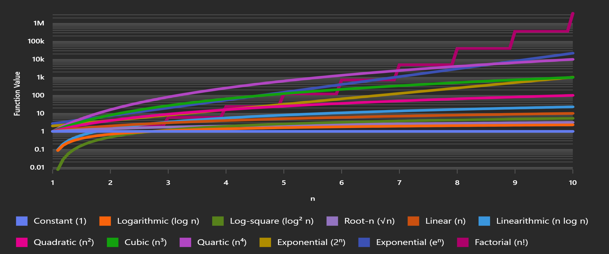

# DSA Notes

###  Big O Vocabulary

1. Growth rates
2. Common functions
3. Big O notation
4. Slower growth
5. Moderate growth
6. Fast growth
7. Large inputs
8. Grow slowly and are more efficient for
9. Are typical in many algorithms
10. Grow extremely fast and are impractical for

### Growth Rates in Big O Notation

1. **Constant**: O(1)
2. **Logarithmic**: O(log n)
3. **Log-square**: O(log² n)
4. **Root-n**: O(√n)
5. **Linear**: O(n)
6. **Linearithmic**: O(n log n)
7. **Quadratic**: O(n²)
8. **Cubic**: O(n³)
9. **Quartic**: O(n⁴)
10. **Exponential**: O(2ⁿ)
11. **Exponential**: O(eⁿ)
12. **Factorial**: O(n!)

### Graph showing growth rates of the common functions using Big O notation

### Interpretation ###

* **Slower growth:** Functions like O(1), O(log n), and O(√n) grow slowly and are more efficient for large inputs.
* **Moderate growth:** O(n), O(n log n), and O(n²) are typical in many algorithms.
* **Fast growth:** O(2ⁿ), O(eⁿ), and specially O(n!) grow extremely fast and are impractical for large inputs.

